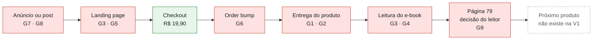
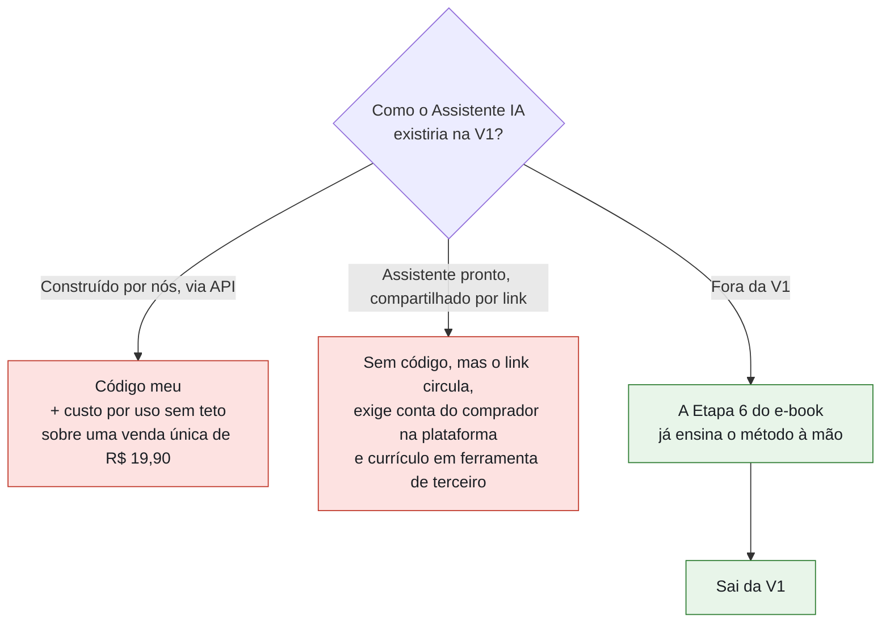
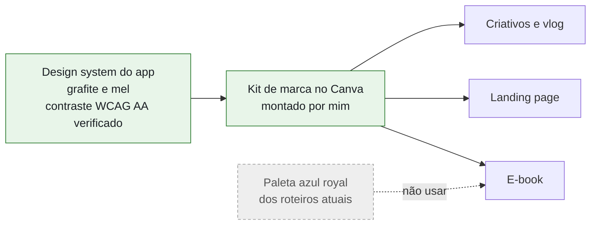
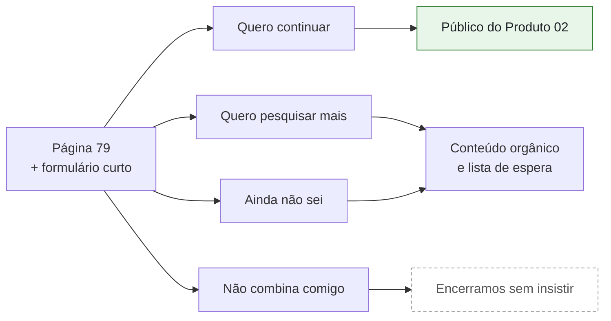
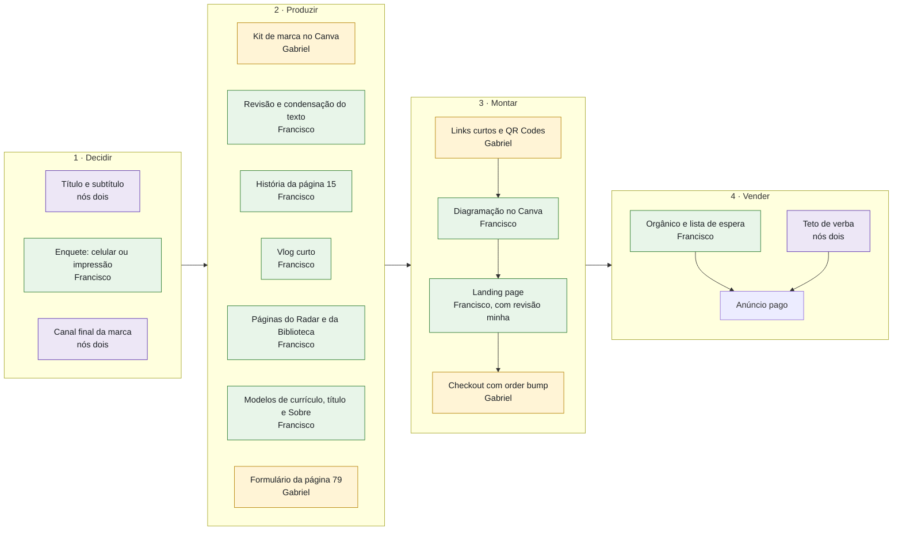

# Revisão da oferta do Produto 01: Jornada do SDR Performance

- **De:** Gabriel Pereira da Costa, produto e tecnologia
- **Para:** Francisco Ericles, comercial e conteúdo
- **Data:** 23/09/2026
- **Status:** aguardando a sua validação na seção 8
- **Base da análise:** Arquitetura da Oferta, Arquitetura do Produto e texto-base do e-book (82 unidades editoriais), na versão que você me passou

> [!IMPORTANT]
> **Resumo em 30 segundos**
>
> O e-book está pronto para a revisão editorial. A oferta em volta dele não está: ela traz de volta, pelos bônus, o escopo que a regra de corte tirou dos capítulos, e isso coloca cerca de 28 itens de produção entre nós e a primeira venda.
>
> Minha decisão é lançar uma V1 enxuta: o e-book, um vlog curto, as duas páginas de apoio que o próprio e-book já exige e um order bump que resolve o passo seguinte do comprador. O que sai não se perde, vira a base do Produto 02.
>
> Três coisas travam a diagramação e precisam de resposta antes dela: identidade visual, formato de leitura e subtítulo.
>
> Preciso da sua validação na seção 8 antes de qualquer página ir para o Canva.

## 1. O que não muda

Francisco, três escolhas suas eu defendo em qualquer corte, porque são elas que tornam essa oferta diferente do que o mercado de "mudança de carreira" costuma vender.

**A lista de promessas proibidas.** Nada de emprego, salário, home office ou formação completa. O público que você descreveu já chega desconfiado de promessa fácil, e essa disciplina é o que vai separar o nosso anúncio de anúncio de golpe.

**O final do e-book em contato com o mercado real.** O leitor pesquisa vagas de verdade e pode concluir que a profissão não é para ele (página 79). Isso reduz reembolso e cria confiança para uma segunda compra.

**A V1 sem app, PWA e CRM.** A oferta não depende do meu tempo de desenvolvimento. A única exceção é o Assistente IA, que trato na seção 3.2.

## 2. Onde a venda trava

Mapeei a jornada do comprador, do anúncio até o fim da leitura, e marquei os pontos onde a oferta atual perde prazo, dinheiro ou confiança.

| Código | Gargalo | O que ameaça | Seção |
|---|---|---|---|
| G1 | O escopo cortado do e-book voltou pelos bônus | Prazo | 3.1 |
| G2 | Assistente IA sem dono, sem plataforma e com custo aberto | Prazo e custo | 3.2 |
| G3 | Materiais especificados em azul royal | Retrabalho | 3.3 |
| G4 | Formato de leitura não decidido | Retrabalho | 3.4 |
| G5 | Subtítulo que contradiz o produto | Confiança | 3.5 |
| G6 | Order bump duas etapas à frente do comprador | Receita | 3.6 |
| G7 | Anúncio pago que não se paga sem upsell | Caixa | 3.7 |
| G8 | Vlog longo e com risco de exposição | Prazo e confiança | 3.8 |
| G9 | O dado mais valioso da jornada se perde | Próximo produto | 3.9 |

## 3. Os gargalos, um por um

### 3.1 G1: o escopo cortado do e-book voltou pelos bônus

O e-book segue a regra de corte à risca: currículo, LinkedIn, entrevista, scripts e IA ficaram fora dos capítulos. A oferta traz tudo isso de volta em cinco bônus e um order bump. A própria Arquitetura da Oferta diz que o produto "não deve depender de valores fictícios, quantidade exagerada de bônus ou ancoragens artificiais", e mesmo assim a conta de produção antes da primeira venda fica assim:

| Lista | Itens abertos |
|---|---|
| Itens operacionais da Arquitetura da Oferta | 16 |
| Pendências gerais do texto-base do e-book | 14 |
| **Total distinto, descontada a sobreposição** | **cerca de 28** |

Quase tudo isso depende de você, ao mesmo tempo em que você grava o Método. E qualquer bônus anunciado que não esteja pronto no dia da compra repete o risco que já registramos de material público prometer o que o produto ainda não tem (R-016), agora com o prazo legal de arrependimento de sete dias[^cdc] correndo contra nós.

**Minha recomendação:** a V1 vende só o que pertence à etapa de descoberta. O resto sai da oferta e vira a base do Produto 02. O desenho completo está na seção 4.

### 3.2 G2: o Assistente IA é o único item que cai em mim, e ninguém definiu como ele existe

A Arquitetura da Oferta não diz quem constrói o assistente nem em qual plataforma. Todos os caminhos têm custo:

O primeiro caminho repete a conta que já apareceu no nosso alinhamento entre curso e app: receita única com custo recorrente, só que em escala menor. O segundo coloca dado pessoal do comprador numa ferramenta de terceiro, exatamente o cuidado de LGPD que já registramos como risco (R-008). E o argumento que decide: os oito blocos de leitura de vaga, a separação entre obrigatório e desejável e a comparação com o Inventário já estão nas páginas 66 a 73 do e-book. O assistente automatizaria algo que o comprador já recebe.

**Minha recomendação:** o Assistente sai da V1. Ele volta a ser avaliado no Produto 02, com dado de uso na mão.

### 3.3 G3: os materiais estão especificados em azul royal

A nossa decisão de identidade visual (DEC-011) está mantida: a identidade da marca é grafite e mel, a mesma do design system do app. Os materiais de produção especificam outra coisa:

| Onde | O que está especificado | Conforme a DEC-011? |
|---|---|---|
| E-book, orientação de diagramação da página 11 | "Azul Royal para destacar as etapas" | Não |
| Roteiro do Módulo 0, paleta-base | Azul profundo `#050B24`, azul royal `#1F4FFF`, mel `#F4B942` | Não |
| Roteiro do Módulo 0, certificado | Azul royal, branco e amarelo mel | Não |
| DEC-011, referência | Grafite `#1B1F24` e mel `#F6C344` | Sim |

Repare que até o mel é outro tom. O momento mais caro para corrigir isso é depois das 76 a 82 páginas diagramadas no Canva.

**Minha recomendação:** eu monto o kit de marca do Canva com os tokens do design system do app (grafite, mel e os tons clareados para contraste) e entrego a você antes da primeira página diagramada. A landing nova já nasce nessa identidade, sem herdar nada das duas versões em azul.

### 3.4 G4: o formato de leitura não foi decidido e muda o layout inteiro

O e-book tem tabelas de quatro colunas (páginas 51, 71 e 73), espaço para escrever à mão e a intenção de ter páginas preenchíveis. O público descrito, de 18 a 26 anos e vindo de caixa, estoque, reposição e telemarketing, provavelmente lê no celular. Digo provavelmente porque isso não está validado: o nosso documento de cliente ideal já lista "celular ou computador" como pergunta em aberto.

Existe também um custo escondido. O Canva não exporta campos preenchíveis: as caixas de texto dele não viram campo de formulário, e os campos precisam ser adicionados depois num editor de PDF[^canva]. Essa tarefa não está em nenhuma das duas listas e é o tipo de trabalho que acaba caindo em mim.

**Minha recomendação:** uma enquete no seu story decide o formato antes da diagramação. Se der celular, a parte de leitura é desenhada para tela vertical e as missões vão para um caderno separado (PDF para imprimir ou documento que o comprador duplica). Em qualquer cenário, PDF preenchível fica fora da V1.

### 3.5 G5: o subtítulo contradiz o próprio produto

| Documento | Subtítulo |
|---|---|
| Arquitetura da Oferta e Arquitetura do Produto | "Conheça tudo sobre a profissão de SDR e saiba por onde começar." |
| Texto-base do e-book | "Descubra uma nova possibilidade profissional: conheça a profissão de SDR e saiba por onde começar." |
| Pendências gerais do e-book | "Definir título e subtítulo" continua aberto |

A própria Arquitetura da Oferta manda evitar "aprenda tudo" e lista o "tudo" absoluto como risco de posicionamento. E a página 5 do e-book diz ao leitor, com todas as letras: "Você não terminará sabendo tudo sobre a profissão." É a primeira linha da landing, e é o tipo de frase que vira reclamação.

**Minha recomendação:** fica o subtítulo do texto-base. Ele bate com a diretriz e com o conteúdo.

### 3.6 G6: o order bump está duas etapas à frente do comprador

Quem chega ao checkout descobriu a profissão minutos antes. O bump oferece "Primeiros 30 dias como SDR", que é o momento depois da contratação, e a própria oferta admite que ele "atende a uma etapa posterior da jornada". Minha leitura, que é hipótese e vamos medir, é que a compra por impulso no checkout funciona melhor quando resolve o passo imediatamente seguinte. E o e-book diz qual é esse passo, na página 74: buscar orientação para currículo, LinkedIn ou entrevistas.

**Minha recomendação:** o bump passa a ser os modelos de currículo, título e "Sobre" (hoje dentro do Bônus 1), no mesmo preço de R$ 4,90. O mapa dos 30 dias vira material de ponte com o Método, entregue a quem for contratado.

### 3.7 G7: sem upsell, o anúncio pago não se paga

Isso não é erro, é consequência de uma decisão consciente: a V1 existe para provar o ciclo, não para dar lucro. Mas a lógica de uma oferta de entrada depende de order bump e upsell para cobrir o custo de aquisição. A referência de mercado que usei aponta conversão típica de 1,5% a 5% em tráfego frio para esse tipo de oferta, com o bump e o upsell pagando o anúncio[^tripwire]. Com R$ 4,90 de bump e nenhum upsell, o anúncio pago vai custar mais do que traz.

**Minha recomendação:** começamos pelo seu orgânico. Anúncio pago só entra com um teto de verba definido por nós dois e registrado antes da primeira campanha, tratado como custo de aprendizado e não como investimento com retorno esperado.

### 3.8 G8: o vlog é a peça que mais rende, e precisa de três ajustes

O vlog é conteúdo do e-book e, ao mesmo tempo, o melhor material de anúncio que temos: para quem não sabe o que um SDR faz, ver um dia real explica mais do que qualquer página de venda.

**Duração.** Trinta minutos é muito para editar e anonimizar na V1, e o próprio texto-base registra que o vlog complementa a Etapa 2, mas não é necessário para entender o conteúdo. Uma versão de cerca de dez minutos serve ao e-book e rende os mesmos trechos para anúncio.

**Confidencialidade.** Se o dia gravado for de um emprego atual seu, confirme com a empresa antes de filmar. Na dúvida, simule com dados fictícios, como o e-book já permite.

**Home office.** É um dia em home office, e um trecho disso num anúncio pode ser lido como promessa de trabalho remoto, que está na lista de proibidas. Todo trecho usado em anúncio leva uma legenda dizendo que existem vagas presenciais, híbridas e remotas.

**Minha recomendação:** vlog de cerca de dez minutos, confidencialidade resolvida antes da gravação e legenda obrigatória em anúncio.

### 3.9 G9: o comprador não está no nosso documento de cliente ideal, e o dado dele se perde

O nosso documento de cliente ideal descreve SDR com até 24 meses na função e a Mariana, que já sabe que a profissão existe e está avaliando entrar. O comprador da Jornada vem antes dela: ainda não sabe que a profissão existe. Isso não contradiz nenhuma decisão, mas o primeiro produto que vamos vender é para uma pessoa que a documentação da marca não descreve. Eu atualizo esse documento.

O ponto maior é outro. A página 79 pergunta ao leitor se ele quer continuar, pesquisar mais, desistir ou se ainda não sabe. Hoje essa resposta fica no papel. Com um formulário curto no fim do e-book, ela vira a primeira medida real de quantos compradores se tornam Mariana, que é o público do Produto 02.

**Minha recomendação:** eu monto um formulário de três perguntas (Google Forms, acessado por QR Code na página 79), com aviso claro de uso dos dados, e cuido da leitura dos resultados.

## 4. A V1 que eu proponho

O critério é o mesmo que o e-book já usa: fica o que leva a pessoa do Estado A ao Estado B, sai o que atende uma etapa posterior. Nada é jogado fora, cada item ganha o seu lugar numa escada de produtos.

Hoje, a oferta de R$ 19,90 vende itens das etapas 1, 2 e 3 ao mesmo tempo. A V1 que proponho vende a etapa 1 e oferece a entrada da etapa 2 no checkout.

```mermaid
flowchart LR
    subgraph E1["Etapa 1 · Descoberta"]
        direction TB
        EB["E-book condensado"]:::v1
        VL["Vlog curto"]:::v1
        RD["Radar de Vagas<br/>página de links + checklist"]:::v1
        BI["Biblioteca Inicial<br/>1 a 3 recursos por assunto"]:::v1
    end
    subgraph E2["Etapa 2 · Primeira vaga"]
        direction TB
        MC["Modelos de currículo,<br/>título e Sobre"]:::bump
        LI["Videoaula de LinkedIn<br/>e currículo comentado"]:::p2
        SE["Simulador de Entrevista"]:::p2
        IA["Assistente IA"]:::p2
    end
    subgraph E3["Etapa 3 · Primeiros dias na vaga"]
        direction TB
        P30["Primeiros 30 dias como SDR"]:::ponte
    end
    subgraph E4["Etapa 4 · Operação"]
        direction TB
        MT["Método SDR Performance<br/>+ aplicativo"]:::ponte
    end
    E1 --> E2 --> E3 --> E4

    classDef v1 fill:#E8F5E9,stroke:#2E7D32,color:#1B1F24
    classDef bump fill:#FFF4D6,stroke:#B8860B,color:#1B1F24
    classDef p2 fill:#EEEEEE,stroke:#757575,color:#1B1F24
    classDef ponte fill:#FFFFFF,stroke:#9E9E9E,stroke-dasharray:4 3,color:#555555
```

Legenda: verde é a V1 a R$ 19,90, amarelo é o order bump, cinza é a base do Produto 02 e tracejado é a ponte com o Método.

| Item | Na V1 | Destino |
|---|---|---|
| E-book, com a Parte 0 condensada de 6 para 2 ou 3 páginas | Fica | Produto principal |
| Vlog, em versão de cerca de 10 minutos | Fica | Dentro do e-book e como matéria-prima de anúncio |
| Radar de Vagas: página de links e checklist, sem videoaula | Fica | A Etapa 6 do e-book já exige essa página |
| Biblioteca Inicial com 1 a 3 recursos por assunto | Fica | A Etapa 5 do e-book já exige essa página |
| Modelos de currículo, título e "Sobre" | Vira o order bump | Resolve o passo seguinte que o e-book aponta |
| Videoaula de LinkedIn, currículo comentado e Simulador de Entrevista | Sai | Base do Produto 02, "primeira vaga" |
| Assistente IA Decodificador de Vagas | Sai | Produto 02, se o dado de uso justificar |
| Black Box expandida | Sai | Cresce aos poucos a partir da Biblioteca Inicial |
| Primeiros 30 dias como SDR | Sai do checkout | Ponte com o Método, para quem for contratado |

Em número, a produção das listas originais cai de cerca de 28 para cerca de 20 itens, e eu acrescento quatro itens pequenos (kit de marca, enquete, formulário e teto de verba) que evitam retrabalho maior. Em esforço, a queda é bem maior do que o número sugere, porque saem justamente os itens mais pesados: duas videoaulas, o simulador, o mapa de 30 dias inteiro, a curadoria expandida e o único item técnico.

O Radar, agora como conteúdo, resolve o risco de prometer software sem lastro (R-016), desde que a landing nova não herde o "portal + alertas" da landing V2.

## 5. Caminho crítico até ligar o checkout

Não coloco data neste documento de propósito. O prazo depende de duas respostas que ainda não temos: o formato de leitura e o tamanho final do e-book depois da condensação. Fecho a data com você na semana em que essas duas respostas chegarem. O que já está definido é a ordem e quem faz cada coisa.

Cada caixa traz o nome de quem faz. A ordem é rígida em dois pontos: a diagramação só começa com título, formato de leitura e kit de marca definidos, porque qualquer um deles mudado depois obriga a refazer páginas; e o anúncio pago só entra depois do orgânico e com o teto registrado. O resto pode correr em paralelo.

A landing é sua. Eu reviso tudo o que ela disser sobre produto, preço ou prazo, pela regra que já combinamos (DEC-015): material público sobre funcionalidade, preço ou prazo passa por nós dois antes de ir ao ar.

## 6. O que fazemos enquanto a diagramação acontece

Dá para testar o gancho antes do produto ficar pronto. Você publica no seu Instagram trechos do vlog ou conteúdo com o ângulo "Competências que podem atravessar profissões" e chama para uma lista de espera. Dos seis ângulos da Arquitetura da Oferta, esse é o mais forte para tráfego frio, porque fala do trabalho que a pessoa tem hoje, e não de uma profissão que ela ainda não conhece. No dia de ligar o checkout, já saberemos qual ângulo converte, e a lista de espera vira a primeira base de contatos que pertence à marca.

Na mesma linha, a última página do e-book manda o leitor seguir o "canal ou perfil final da SDR Performance". Esse canal precisa ser o perfil da marca, e não o seu perfil pessoal. O seu perfil continua sendo o topo do funil, mas cada comprador que termina o e-book tem que chegar a um canal que é da sociedade. É a resposta ao risco que já registramos de a marca depender de um rosto só (R-007).

## 7. Fora do escopo desta revisão

O roteiro do Módulo 0 do Método continua dependendo de telas que o app não tem: quiz, rota, missão, evidência e instalação. O risco de o currículo pedir telas que não existem (R-017) segue aberto, e a decisão de reclassificar o MVP do currículo em três camadas (DEC-019) ainda não saiu. Não grave essas capturas até essa decisão ser tomada. A paleta azul royal do mesmo roteiro segue a regra da seção 3.3.

## 8. Validação de Diretrizes

Cada item traz o problema, a minha recomendação já marcada e o espaço para a sua decisão. Se você concordar, não precisa mexer no item. Se discordar, marque "Rejeitado" e escreva a alternativa na mesma linha. Tudo o que for aprovado entra no nosso registro de decisões como a próxima entrada livre.

| # | Tema | Recomendação |
|---|---|---|
| D1 | Identidade visual | Grafite e mel em todos os materiais |
| D2 | Subtítulo | O do texto-base do e-book |
| D3 | Composição da V1 | E-book, vlog curto, Radar e Biblioteca Inicial |
| D4 | Assistente IA | Fora da V1 |
| D5 | Order bump | Modelos de currículo, título e "Sobre" a R$ 4,90 |
| D6 | Formato de leitura | Enquete antes da diagramação e nada de PDF preenchível |
| D7 | Vlog | Cerca de 10 minutos, confidencialidade resolvida e legenda em anúncio |
| D8 | Tráfego | Orgânico primeiro, pago só com teto registrado |
| D9 | Dado da página 79 | Formulário curto no fim do e-book |
| D10 | Canal final | Perfil da marca na última página |
| D11 | Responsabilidades | Conforme o caminho crítico da seção 5 |

### D1 · Identidade visual

**Problema:** o e-book (página 11) e o roteiro do Módulo 0 especificam azul royal, e até o mel é outro tom. A DEC-011 definiu grafite `#1B1F24` e mel `#F6C344`.

**Recomendação:** grafite e mel em todos os materiais do Produto 01 e do Método. Eu entrego o kit de marca do Canva antes da primeira página diagramada.

- [x] Aprovado conforme recomendado
- [ ] Rejeitado. Alternativa:

### D2 · Subtítulo

**Problema:** existem dois subtítulos "oficiais", e o da Arquitetura da Oferta promete "tudo", contra a diretriz da própria oferta e contra a página 5 do e-book.

**Recomendação:** adotar "Descubra uma nova possibilidade profissional: conheça a profissão de SDR e saiba por onde começar." em todos os materiais.

- [x] Aprovado conforme recomendado
- [ ] Rejeitado. Alternativa:

### D3 · Composição da V1

**Problema:** a oferta atual soma cinco bônus e cerca de 28 itens de produção antes da primeira venda, vendendo três etapas da jornada por R$ 19,90.

**Recomendação:** a V1 vende a etapa de descoberta: e-book condensado, vlog curto, Radar de Vagas como página de links e checklist, e Biblioteca Inicial com 1 a 3 recursos por assunto. Videoaula de LinkedIn, currículo comentado, Simulador de Entrevista e Black Box expandida saem e formam a base do Produto 02.

- [x] Aprovado conforme recomendado
- [ ] Rejeitado. Alternativa:

### D4 · Assistente IA Decodificador de Vagas

**Problema:** não tem dono nem plataforma, todo caminho de construção tem custo (código, custo por uso ou link vazando) e ele automatiza um método que o e-book já ensina nas páginas 66 a 73.

**Recomendação:** fora da V1. Reavaliado no Produto 02, com dado de uso.

- [x] Aprovado conforme recomendado
- [ ] Rejeitado. Alternativa:

### D5 · Order bump

**Problema:** "Primeiros 30 dias como SDR" atende quem já foi contratado, duas etapas à frente de quem acabou de descobrir a profissão.

**Recomendação:** o bump passa a ser os modelos de currículo, título e "Sobre", mantidos os R$ 4,90. O mapa de 30 dias vira material de ponte com o Método.

- [x] Aprovado conforme recomendado
- [ ] Rejeitado. Alternativa:

### D6 · Formato de leitura

**Problema:** o layout de 76 a 82 páginas depende de o leitor usar celular ou papel, e ninguém validou isso. PDF preenchível exige uma etapa fora do Canva que não está em nenhuma lista.

**Recomendação:** enquete no seu story antes da diagramação. Se der celular, leitura vertical e caderno de missões separado. PDF preenchível fora da V1 em qualquer cenário.

- [x] Aprovado conforme recomendado
- [ ] Rejeitado. Alternativa:

### D7 · Vlog

**Problema:** 30 minutos para editar e anonimizar, possível exposição de dados de empregador e risco de o home office ser lido como promessa.

**Recomendação:** versão de cerca de 10 minutos, confidencialidade resolvida antes de gravar (ou dia simulado com dados fictícios) e legenda sobre vagas presenciais, híbridas e remotas em todo trecho usado em anúncio.

- [x] Aprovado conforme recomendado
- [ ] Rejeitado. Alternativa:

### D8 · Tráfego

**Problema:** sem upsell, a receita da venda não cobre o custo do anúncio pago.

**Recomendação:** orgânico primeiro, com lista de espera durante a diagramação. Anúncio pago só com teto de verba definido por nós dois e registrado antes da primeira campanha.

- [x] Aprovado conforme recomendado
- [ ] Rejeitado. Alternativa:

### D9 · Dado da página 79

**Problema:** a decisão do leitor (continuar, pesquisar, desistir, não saber) fica no papel e se perde.

**Recomendação:** formulário de três perguntas no fim do e-book, acessado por QR Code, com aviso de uso dos dados. Eu monto e cuido da leitura.

- [x] Aprovado conforme recomendado
- [ ] Rejeitado. Alternativa:

### D10 · Canal final da marca

**Problema:** se a última página levar ao seu perfil pessoal, cada comprador reforça a dependência de um rosto só em vez de construir um canal da sociedade.

**Recomendação:** a última página aponta para o perfil da SDR Performance e para a lista de espera. O seu perfil segue como topo do funil.

- [x] Aprovado conforme recomendado
- [ ] Rejeitado. Alternativa:

### D11 · Divisão de responsabilidades

**Problema:** a Arquitetura da Oferta lista o que produzir, mas não diz quem produz, e item sem dono não anda.

**Recomendação:** divisão conforme o diagrama da seção 5. Eu fico com o kit de marca, o formulário da página 79, os links curtos e QR Codes e o checkout. Você fica com a enquete, a revisão do texto, a história da página 15, o vlog, as páginas de apoio, os modelos, a diagramação, a landing e o orgânico. Título, subtítulo, canal final e teto de verba decidimos juntos.

- [x] Aprovado conforme recomendado
- [ ] Rejeitado. Alternativa:

### Assinaturas

| Papel | Nome | Assinatura | Data |
|---|---|---|---|
| Proposta | Gabriel Pereira da Costa | Gabriel P. da Costa | 23/09/2026 |
| Validação | Francisco Ericles | | |

[^cdc]: Direito de arrependimento do Código de Defesa do Consumidor (art. 49), que vale para compras feitas fora do estabelecimento comercial, como as feitas pela internet.
[^canva]: "Canva can create the design, but its text boxes are not PDF form fields." Fonte: [Formester, How to Make a Canva PDF Fillable](https://formester.com/blog/how-to-make-canva-pdf-fillable/).
[^tripwire]: Referência de mercado, majoritariamente de infoprodutos nos Estados Unidos, e não do nosso nicho. Fonte: [CartFlows, What Is a Tripwire Funnel?](https://cartflows.com/blog/tripwire-funnel/).
